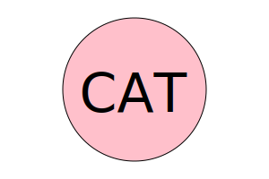
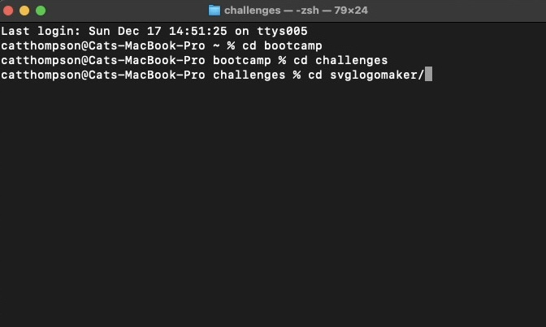
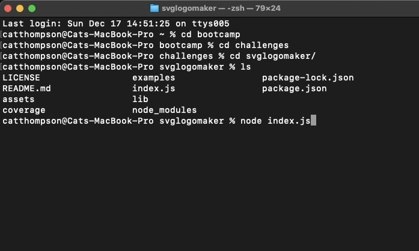
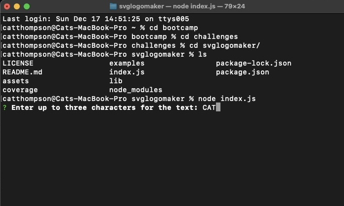
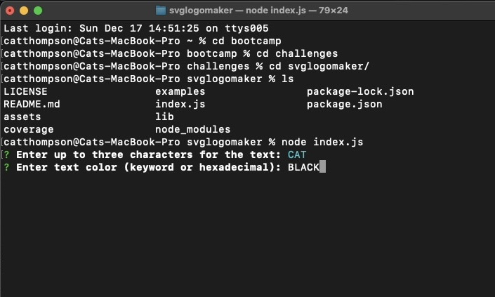
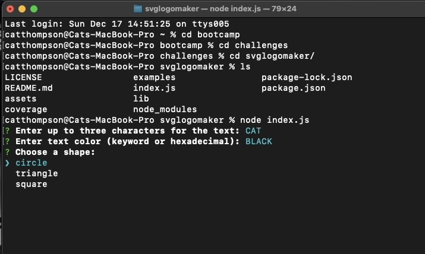
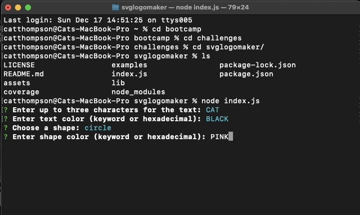
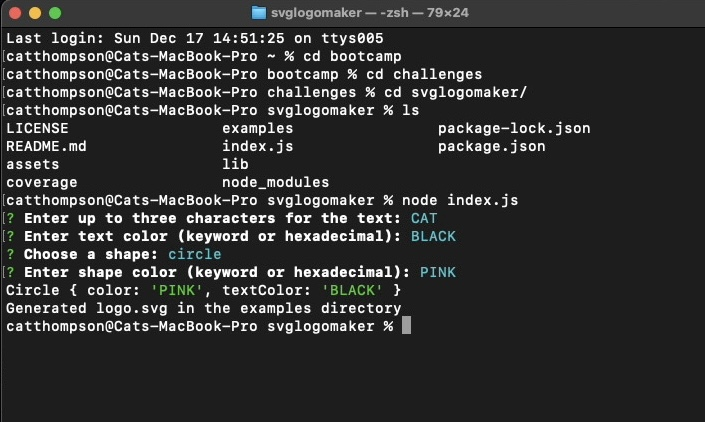

# 10 Object-oriented Programming: SVG Logo Maker

### User Story (from assignment)

```m
AS a freelance web developer
I WANT to generate a simple logo for my projects
SO THAT I do not have to pay a graphic designer
```

## Acceptance Criteria (from assignment)
```m
GIVEN a command-line application that accepts user input
WHEN I am prompted for text
THEN I can enter up to three characters
WHEN I am prompted for the text color
THEN I can enter a color keyword (OR a hexadecimal number)
WHEN I am prompted for a shape
THEN I am presented with a list of shapes to choose from: circle, triangle, and square
WHEN I am prompted for the shape's color
THEN I can enter a color keyword (OR a hexadecimal number)
WHEN I have entered input for all the prompts
THEN an SVG file is created named `logo.svg`
AND the output text "Generated logo.svg" is printed in the command line
WHEN I open the `logo.svg` file in a browser
THEN I am shown a 300x200 pixel image that matches the criteria I entered
```

## Installation

1. Ensure you have NodeJS installed to utilize this application. Click [here](https://nodejs.org/en) to visit the NodeJS Website.
2. Clone the Git repository 
3. After cloning the repo, open your Command Line application (Command prompt/Terminal) and navigate to your repository's directory.
4. In the command line, do `npm i` to download the needed npm packages.
5. After installing the necessary packages, run the application by typing `node index.js` in your command line.

## Mock-Up

[LINK TO VIDEO DEMO](https://youtu.be/5b_2HeSgubU)

## Usage
1. `cd`into the svglogomaker file

2. Type `node index.js` into the command line

3. There you will be prompted to enter 3 letters to beginning making your logo

4. Enter the text color 

5. Choose the shape

6. Enter the background color

7. Upon entering the information, your new logo will automatically be saved as logo.svg to the 'emaples' folder designated in the code



## Resources
1. **Node.js Documentation**
   - [Node.js Official Documentation](https://nodejs.org/en/docs/)

2. **Inquirer.js GitHub Repository**
   - [Inquirer.js on GitHub](https://github.com/SBoudrias/Inquirer.js)

3. **MDN Web Docs (SVG)**
   - [SVG Tutorial on MDN](https://developer.mozilla.org/en-US/docs/Web/SVG/Tutorial)

4. **W3Schools (JavaScript)**
   - [JavaScript Tutorial on W3Schools](https://www.w3schools.com/js/)

5. **Jest Documentation**
   - [Jest Official Documentation](https://jestjs.io/docs/getting-started)

